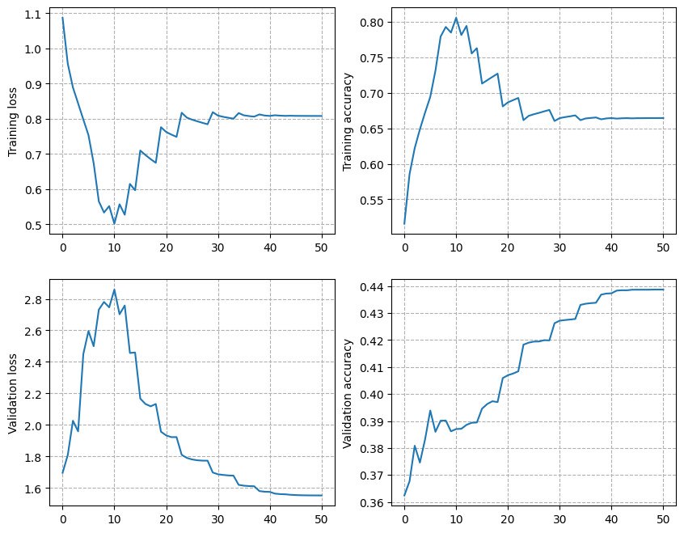

# Raw Speech Classification

Trains CNN (or any neural network based) classifiers from raw speech
using Keras and tests them. The inputs are lists of wav files,
where each file is labelled. It then creates fixed length signals and
processes them. During testing, it computes scores at the
utterance or speaker levels by averaging the corresponding frame-level
scores from the fixed length signals.

## Installation

### In a Conda environment

To install Keras 3 with PyTorch backend, run:

```bash
conda env create -f conda/rsclf-pytorch.yaml
```

To install Keras 3 with TensorFlow backend, run:

```bash
conda env create -f conda/rsclf-tensorflow.yaml
```

### With pip

If you want to install this package from pypi, you can run the following:

```bash
pip install raw-speech-classification
```

By default it install with pytorch, but you can install tensorflow. You'll need to set
the `KERAS_BACKEND` environment variable to the correct backend:

```bash
export KERAS_BACKEND=torch
```

## Using the code

1. Create lists for training, cross-validation and testing.
   Each line in a list must contain the path to a wav file (relative to the `-R` _conda
   install_ or `--root` _pip install_ option), followed by its integer label indexed
   from 0, separated by a space.
   E.g if your files are in `/home/bob/data/my_dataset/file*.wav`, set the `root` option
   to `/home/bob/data` and the content of the files as:

   ```txt
   my_dataset/file1.wav 1
   my_dataset/file2.wav 0
   ```

1. **If you installed with Conda:** Configure and run [`run.sh`](run.sh). Provide model
   architecture as an argument. See
   [`model_architecture.py`](rsclf/model_architecture.py) for valid options. Optionally,
   provide an integer as a count of the number of times the experiment is repeated. This
   is useful when the same experiment needs to be repeated multiple times with different
   initializations. The argument defaults to 1.

   **If you installed with pip:** You can run the following commands:

   ```bash
   rsclf-wav2feat --wav-list-file list_files/cv.list --feature-dir output/cv_feat --mode train --root path/to/dataset/basedir
   rsclf-wav2feat --wav-list-file list_files/train.list --feature-dir output/train_feat --mode train --root path/to/dataset/basedir
   rsclf-wav2feat --wav-list-file list_files/test.list --feature-dir output/test_feat --mode test --root path/to/dataset/basedir
   KERAS_BACKEND=torch rsclf-train --train-feature-dir output/train_feat --validation-feature-dir output/cv_feat --output-dir output/cnn_subseg --arch subseg --splice-size 25 --verbose 2
   KERAS_BACKEND=torch rsclf-test --feature-dir output/test_feat --model-filename output/cnn_subseg/cnn.keras --output-dir output/cnn_subseg --splice-size 25 --verbose 0
   ```

This is an example of how to run on the IEMOCAP dataset using conda assuming conda is
installed in `~/miniconda3` and your environment is `rsclf`:

```bash
bash run.sh -C ~/miniconda3 -n rsclf -D ./datasets/IEMOCAP/F1_lists -a seg -o results/seg-f1 -R <IEMOCAP_ROOT>
```

For instance, `<IEMOCAP_ROOT>` can be `/ssd/data/IEMOCAP` which should
contain `IEMOCAP_full_release/Session*`.

This is an [example](./docs/log.txt) of the log printed to the
terminal and you should obtain the following curve in
`results/seg-f1/plot.png`:



## Code components

1. [`wav2feat.py`](rsclf/wav2feat.py) creates directories where the
   wav files are stored as fixed length frames for faster access
   during training and testing.

1. [`train.py`](rsclf/train.py) is the Keras training script.

1. Model architecture can be configured in
   [`model_architecture.py`](rsclf/model_architecture.py).

1. [`rawdataset.py`](rsclf/rawdataset.py) provides an object that
   reads the saved directories in batches and retrieves mini-batches
   for training.

1. [`test.py`](rsclf/test.py) performs the testing and generates
   scores as posterior probabilities. If you need the results per
   speaker, configure it accordingly (see the script for details). The
   default output format is:

   ```txt
    <speakerID> <label> [<posterior_probability_vector>]
   ```

## Training schedule

The script uses stochastic gradient descent with 0.5 momentum. It
starts with a learning rate of 0.1 for a minimum of 5 epochs. Whenever
the validation loss reduces by less than 0.002 between successive
epochs, the learning rate is halved. Halving is performed until the
learning rate reaches 1e-7.

## Contributors

Idiap Research Institute

Authors: S. Pavankumar Dubagunta and Dr. Mathew Magimai-Doss

## License

GNU GPL v3
